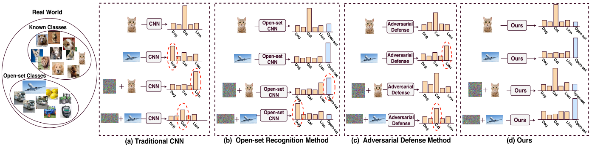
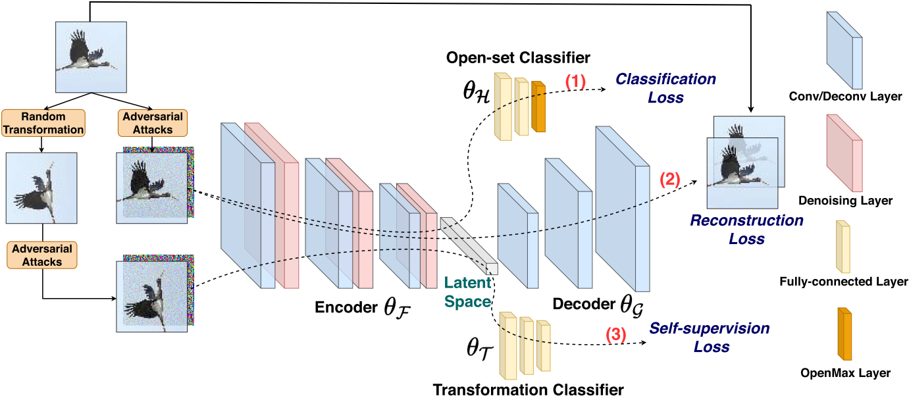

# ECCV2020-OSAD

Pytorch codes for Open-set Adversarial Defense <a href=https://www.ecva.net/papers/eccv_2020/papers_ECCV/papers/123620664.pdf> (pdf) </a> in ECCV 2020 

Challenges in open-set recogntion and adversarial robustness. (a) Conventional CNN classifiers fail in the presence of both open-set and adversarial images. (b) Open-set recognition methods can successfully identify open-set samples, but fail on adversarial samples. (c) Adversarial defense methods are unable to identify open-set samples. (d) Proposed method can identify open-set images and it is robust to adversarial images.



Thus this paper proposes a new research problem named Open-Set Adversarial Defense (OSAD) where adversarial attacks are studied under an open-set setting. We propose an Open-Set Defense Network (OSDN) that learns a latent feature space that is robust to adversarial attacks and informative to identify open-set samples.

Network structure of the proposed Open-Set Defense Network (OSDN). It consists of four components: encoder, decoder, open-set classifier and transformation classifier.



# Setup

* Prerequisites: Python3.6, pytorch=1.2, Numpy, TensorboardX, Pillow, SciPy, h5py, libmr

* The source code folders:

  1. "models": Contains the network architectures of proposed Open-Set Defense Network. 
  2. "advertorch": Contains adversarial attacks such as FGSM and PGD. Thanks the codes from: https://github.com/BorealisAI/advertorch
  3. "OpensetMethods": Contains the open-max function. Thanks the codes from: https://github.com/lwneal/counterfactual-open-set
  4. "datasets": Contains datasets
  5. "misc": Contains initialization and some preprocessing functions
  
# Training

To run the train file: python train.py

# Testing

To run the test file: python test.py

It will generate .txt file that contains the score for close-set accuracy and AUROC.

# Acknowledge
Please kindly cite this paper in your publications if it helps your research:
```
@InProceedings{Shao_2020_ECCV,
author = {Shao, Rui and Perera, Pramuditha and Yuen, Pong C and Patel, Vishal M.},
title = {Open-set Adversarial Defense},
booktitle = {European Conference on Computer Vision (ECCV},
year = {2020}
}
```

Contact: ruishao@comp.hkbu.edu.hk
